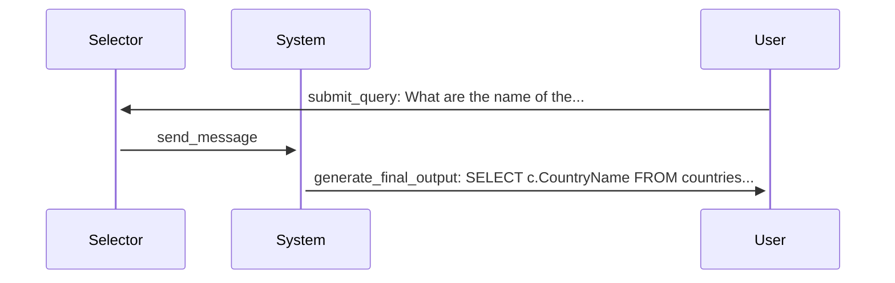

# Agent Flow Tracking System

The Agent Flow Tracking System is a robust solution for monitoring, analyzing, and visualizing the communication between agents in the MAC-SQL framework. This system is designed to help developers and researchers understand the complex interactions between different components of the agent-based SQL generation pipeline.

## Features

- **Comprehensive Message Tracking**: Records all messages between agents with detailed metadata.
- **Hierarchical Message Chains**: Maintains parent-child relationships between messages.
- **Multiple Visualization Formats**: Supports plain text tables, HTML interactive visualizations, Mermaid sequence diagrams, and JSON export.
- **Configurable Behavior**: Extensive configuration options via environment variables or direct API.
- **Non-invasive Integration**: Minimal impact on the existing codebase.
- **Extensible Architecture**: Observer pattern allows for custom listeners and extensions.

## Quick Start

### Basic Usage

To enable agent flow tracking in your test script:

```python
from core.agent_flow import install_flow_tracker, print_agent_flow

# Initialize chat manager
chat_manager = EnhancedChatManager(...)

# Install the flow tracker
install_flow_tracker(chat_manager)

# Run your agent-based SQL generation
chat_manager.start(message)

# Display the communication flow
print_agent_flow()
```

### Visualizing Agent Flow

To generate visualizations of agent communication:

```python
from core.agent_flow import visualize_agent_flow

# Generate an HTML visualization
visualize_agent_flow(format_type="html", output_path="output/agent_flow.html")

# Generate a Mermaid diagram
visualize_agent_flow(format_type="mermaid", output_path="output/agent_flow.md")

# Export as JSON
visualize_agent_flow(format_type="json", output_path="output/agent_flow.json")
```

### Command Line Options

The test script supports several command-line options for agent flow tracking:

```bash
python test_macsql_agent_spider.py --samples 1 --visualize --viz-format html --viz-output output/visualization.html
```

Available options:
- `--visualize`: Enable agent flow visualization
- `--viz-format`: Visualization format (html, json, mermaid)
- `--viz-output`: Path to save visualization output
- `--full-trace`: Show full trace information including raw messages

## Configuration

The agent flow tracking system can be configured via environment variables or by directly updating the configuration object.

### Environment Variables

| Variable | Description | Default |
|----------|-------------|---------|
| `AGENT_FLOW_ENABLED` | Enable or disable tracking | `true` |
| `AGENT_FLOW_TRACK_RAW` | Store raw message data | `false` |
| `AGENT_FLOW_DISPLAY_FORMAT` | Display format (table, mermaid) | `table` |
| `AGENT_FLOW_TABLE_SQL_LENGTH` | Max SQL length in table output | `60` |
| `AGENT_FLOW_SHOW_SQL` | Show SQL in table output | `true` |
| `AGENT_FLOW_VIZ_FORMAT` | Visualization format (html, json, mermaid) | `html` |
| `AGENT_FLOW_VIZ_DIR` | Output directory for visualizations | `output` |
| `AGENT_FLOW_AUTO_VIZ` | Auto-generate visualizations | `false` |
| `AGENT_FLOW_SAVE_TO_FILE` | Save tracking data to file | `false` |
| `AGENT_FLOW_OUTPUT_FILE` | File path for tracking data | `output/agent_flow.json` |
| `AGENT_FLOW_CLEAR_ON_START` | Clear existing data on start | `true` |

### Direct Configuration

You can also update the configuration programmatically:

```python
from core.agent_flow_config import config

# Update configuration
config.update(
    enabled=True,
    track_raw_messages=True,
    visualization_format="html",
    auto_visualize=True
)
```

## Architecture

The agent flow tracking system consists of several components:

1. **MessageTracker**: The core tracking component that maintains message chains and relationships.
2. **AgentFlowConfig**: Configuration management with environment variable support.
3. **Visualization Utilities**: Components for generating different visualization formats.
4. **Hook Functions**: Non-invasive integration with the existing chat manager.

### Message Structure

Each tracked message contains:

- **id**: Unique identifier for the message
- **parent_id**: ID of the parent message (if any)
- **session_id**: Current tracking session ID
- **timestamp**: When the message was created
- **from_agent**: The agent sending the message
- **to_agent**: The agent receiving the message
- **action**: The type of action (e.g., submit_query, receive_message)
- **data**: Extracted data fields from the message
- **raw_message**: (Optional) Complete message data

## Example Output

### Text Table

```
Step | From    | To       | Action          | Query/SQL
----------------------------------------------------------------
1    | User    | Selector | submit_query    | Q: What are the name of the countries where there is not a single car maker?
2    | Selector| System   | receive_message | 
3    | System  | User     | generate_final_output | SQL: SELECT c.CountryName FROM countries c LEFT JOIN car_makers cm ...
```

### Mermaid Diagram



## Integration with MAC-SQL

The agent flow tracking system is designed to integrate seamlessly with the MAC-SQL framework. It hooks into the `EnhancedChatManager` to track all messages between agents without modifying the core functionality.

When a message is processed:

1. The original message is captured before processing
2. The message is tracked with a unique ID
3. The message is processed by the original handler
4. The processed message is tracked with a reference to the original
5. Visualizations are generated if requested

This approach ensures that the tracking system has minimal impact on the core functionality while providing comprehensive visibility into the agent communication flow.

## Use Cases

- **Debugging**: Quickly identify where and why SQL generation is failing
- **Research**: Analyze agent behavior and communication patterns
- **Optimization**: Identify inefficient communication or redundant messages
- **Documentation**: Generate visualizations for papers or presentations
- **Education**: Help new users understand the system architecture

## Future Enhancements

- **Performance Metrics**: Track timing information for each message
- **Error Tracking**: Better integration with error handling
- **Live Visualization**: Real-time updates to visualizations
- **Filtering and Search**: More advanced query capabilities for message analysis
- **Comparative Analysis**: Compare different agent configurations side-by-side 